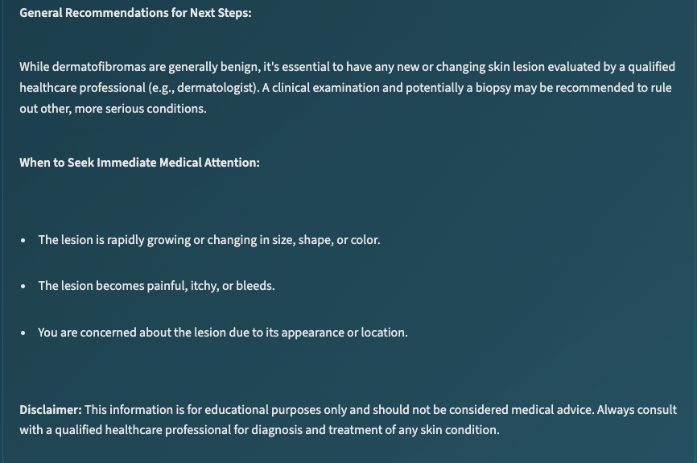

# HAM10K_AI_Platform
# Skin Lesion Classification & Medical Interpretation Platform 
*Dual Ensemble Vision Models +  AI Report Generation*
<div align="center">


</div>

## 1. What This Project Does
This platform performs two coordinated tasks:
1. Classifies dermatoscopic skin lesion images into 1 of 7 HAM10000 classes using an ensemble of two SeresNeXt models. 
2. Generates a structured, patient‑oriented medical advisory using a local MedGemma (via LM Studio) language model with a carefully constrained prompt. 

## 2. High‑Level Data & Model Flow
```
User Image → Streamlit UI → FastAPI /predict → Ensemble Inference (Model A + Model B) →
Probabilities + Metadata → /interpret (or /analyze) → Structured Prompt → MedGemma (LM Studio)
                ↘ (If LM Studio down) Fallback Template
→ Final Report (Markdown) → UI Rendering
```




## 3. Core Features
| Category | Capability |
|----------|------------|
| Vision Models | Dual ensemble (Model A + Model B); TTA averaging; probability distribution export |
| Medical Interpretation | Structured prompt → MedGemma 4B (LM Studio) → fallback safe text |
| Frontend | Modern Streamlit interface with confidence visualization & interpretation pane |
| Backend | FastAPI service, health & metrics endpoints, model path fallback logic |
| Safety | File validation, structured disclaimers, urgency triage labels |
| Extensibility | Pluggable model architecture (timm), environment‑based config |

## 4. Classes & Labels
`actinic_keratoses`, `basal_cell_carcinoma`, `benign_keratosis-like_lesions`, `dermatofibroma`, `melanocytic_nevi`, `melanoma`, `vascular_lesions`

Each returns: predicted class, confidence, urgency tier, human description, full probability map.

## 5. Medical Interpretation Prompt 
The prompt enforces nine Markdown sections: Condition Overview, Confidence Meaning, Key Features, Recommended Actions, Immediate Care Triggers, Self‑Monitoring Checklist, Prevention Tips, Professional Follow‑Up Rationale, Disclaimers. Language is constrained (screening only; no definitive diagnosis). See `LocalMedicalInterpreter.create_medical_prompt()` for full text.

## 6. Repository Layout (Essential Parts)
```
src/
    api/main.py               # FastAPI backend
    frontend/app.py           # Streamlit UI
    models/inference.py       # Ensemble inference logic
    models/medgemma_interpreter.py  # Interpretation pipeline
    utils/config.py           # Settings & class metadata

    > Model weights (`best_model_A_tuned.pth`, `best_model_B_tuned.pth`) are available for download from [Hugging Face: huseyincavus/ham10k_platform](https://huggingface.co/huseyincavus/ham10k_platform).  
    Download and place them at the project root or as configured in your `.env`.
```

## 7. Quick Start (Local, CPU)
```bash
git clone huseyincavusbi/ham10k
cd skin-cancer-detection
python -m venv venv
source venv/bin/activate  # Windows: venv\Scripts\activate
pip install -r requirements/requirements.txt

# Place or verify model weight files at repo root:
ls best_model_*_tuned.pth

# Start backend (port 8002 chosen to avoid collisions)
python -m uvicorn src.api.main:app --host 0.0.0.0 --port 8002

# In a second shell (same venv) start Streamlit UI
streamlit run src/frontend/app.py --server.port 8501
```
Open: http://localhost:8501

## 8. Environment Configuration
Create `.env` in project root (only override what you need):
```dotenv
MODEL_A_PATH=/app/models/best_model_A_tuned.pth  # container path (fallback to root files if absent)
MODEL_B_PATH=/app/models/best_model_B_tuned.pth
MODEL_NAME=seresnext101_32x8d
NUM_CLASSES=7
DEVICE=auto              # auto|cpu|cuda
API_HOST=0.0.0.0
API_PORT=8002            # UI expects 8002 (adjust if modified in code/UI)
LM_STUDIO_ENDPOINT=http://localhost:1234/v1/chat/completions
LM_STUDIO_MODEL=medgemma-4b-it
LOG_LEVEL=INFO
```
If `MODEL_A_PATH` / `MODEL_B_PATH` don’t exist, the backend automatically tries `./best_model_A_tuned.pth` and `./best_model_B_tuned.pth`.
<div align="center">


## Notes / Limitations
- Educational project – not a medical device.
- Ensemble assumes both weight files exist; adjust code if using single model.
- Confidence ≠ diagnosis; always seek professional evaluation.

## License
MIT
